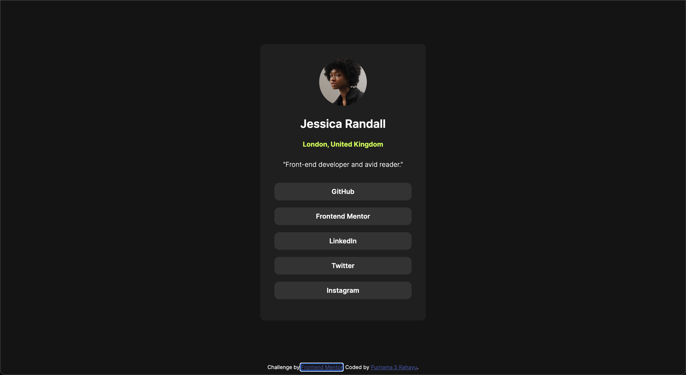

# Frontend Mentor - Social links profile solution

This is a solution to the [Social links profile challenge on Frontend Mentor](https://www.frontendmentor.io/challenges/social-links-profile-UG32l9m6dQ). Frontend Mentor challenges help you improve your coding skills by building realistic projects.

## Table of contents

- [Overview](#overview)
  - [The challenge](#the-challenge)
  - [Screenshot](#screenshot)
  - [Links](#links)
- [My process](#my-process)
  - [Built with](#built-with)
  - [What I learned](#what-i-learned)
- [Author](#author)

**Note: Delete this note and update the table of contents based on what sections you keep.**

## Overview

### The challenge

Users should be able to:

- See hover and focus states for all interactive elements on the page

### Screenshot



### Links

- Solution URL: [GitHub](https://github.com/catreedle/social-links-profile)
- Live Site URL: [Add live site URL here](https://your-live-site-url.com)

## My process

### Built with

- Semantic HTML5 markup
- CSS custom properties
- Flexbox

### What I learned

In this challenge I feel more comfortable around centering elements and using flexbox, thanks to the previous two challenges. I also learned to style anchor `<a>...</a>` to looks like button and override its default styling.

```css
.card a {
  ...
  text-decoration: none;
  color: var(--white);
}
```

The list elements are positioned slightly to the right, even though I already centered them. I reset their margin and padding to override default styles from browser or parent component to fix this.

```css
ul,
li {
  margin: 0;
  padding: 0;
}
```

## Author

- Website - [Add your name here](https://www.purnamaa.dev)
- Frontend Mentor - [@yourusername](https://www.frontendmentor.io/profile/catreedle)
  **Note: Delete this note and add/remove/edit lines above based on what links you'd like to share.**
